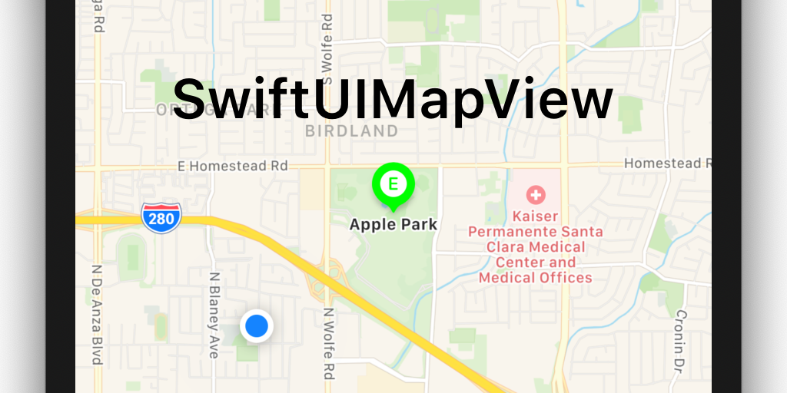

# swiftui-mapview


[](https://swiftpackageindex.com/sgade/swiftui-mapview)


[MKMapView](https://developer.apple.com/documentation/mapkit/mkmapview) in SwiftUI.

**For iOS 14 and later, please use Apple's official [Map](https://developer.apple.com/documentation/mapkit/map) view.**

[](assets/screen.png)
(Click the image to see the full screenshot)

## Install

Using Xcode, select `File` -> `Swift Packages` -> `Add Package Dependency` and enter `https://github.com/sgade/swiftui-mapview`.

## Usage

In your view, add the map.
See the [example project](MapViewExample) for how to integrate the map view.

```swift
import SwiftUIMapView

struct ContentView: View {
    var body: some View {
        MapView()
    }
}
```

### General

#### Map type

```swift
MapView(mapType: .standard)
```

### User location

#### Showing the current user location

The current location can be shown on the map. By default, this is `true`.
Note that the application requires permission to access the current user location.
See the documentation on `MapView.showsUserLocation` for more information.

```swift
MapView(showsUserLocation: true)
```

#### Tracking the user's location

```swift
MapView(userTrackingMode: .follow)
```

### Region

#### Setting the visible region center

The binding passed in for `center` defines the visible region. Setting it to `nil` will use the map's default region when loaded.
It is also updated when the visible region changes.

```swift
@State var center: CLLocationCoordinate2D?

MapView(center: self.$center)
```

#### Setting the visible region zoom

The binding passed in for `zoom` defines the visible region span. A default zoom is used if you do not specify any value.
It is also updated when the visible region changes.

```swift
@State var zoom: MKCoordinateSpan

MapView(zoom: self.$zoom)
```

### Annotations

### Adding annotations

Annotations are represented as objects of a custom class that implements the `MapViewAnnotation` protocol.
It might be helpful to sublcass from existing classes like `MKPlacemark`.

```swift
let annotations: [MapViewAnnotation] = ...

MapView(annotation: self.annotations)
```

### Selecting annotations

A list of selected annotations can be passed in via binding.
Selecting an annotations updates the binding, and the other way around.

```swift
@State var selectedAnnotations: [MapViewAnnotation] = []

MapView(selectedAnnotations: self.$selectedAnnotations)
```

## Contributing

See the [contributing guide](CONTRIBUTING.md).

## License

This project is licensed unter the terms of the MIT license. See [LICENSE](./LICENSE) for more information.
